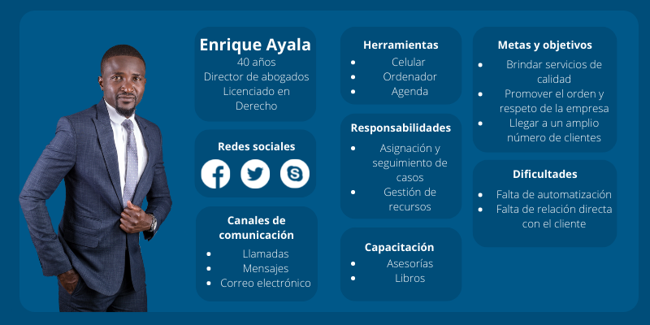
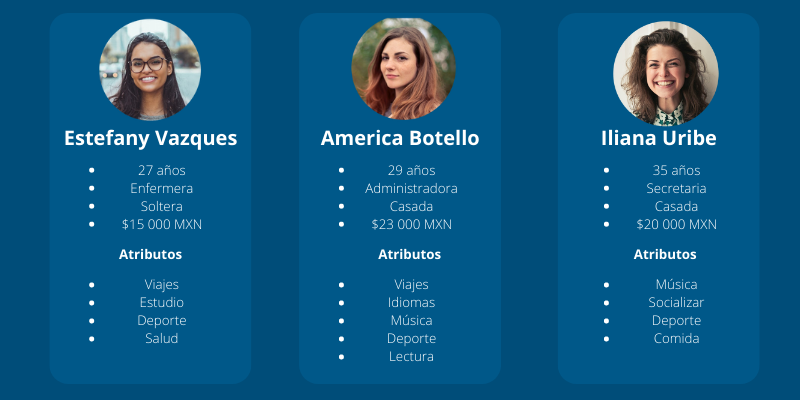
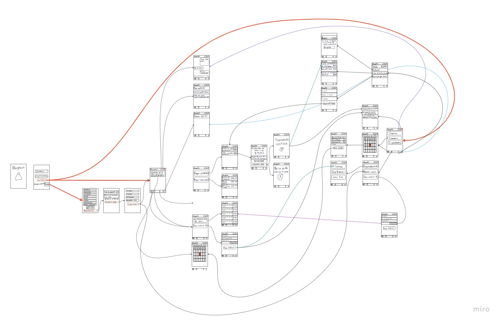

# abogabot
Práctica de Abogabot

<b>DESCRIPCIÓN GENERAL DEL REQUERIMIENTO:</b>
Un despacho de abogados quiere automatizar las demandas de sus clientes a traves de una pagína web, el cliente desde la página puede realizar pagos y ver el las actualizaciones de su demanda.

<b>ANALISIS DE REQUISITOS Y REQUERIMIENTOS</b>
.jpg)

<b>BUYER PERSONA  </b>

<b>PUBLICO OBJETIVO  </b>

<b>WIREFRAME</b>   <b>(Imagen solamente para representación gráfica)</b>
https://miro.com/app/live-embed/uXjVPNoOnSo=/?moveToViewport=-3577,-828,8436,4141&embedId=504299681896

